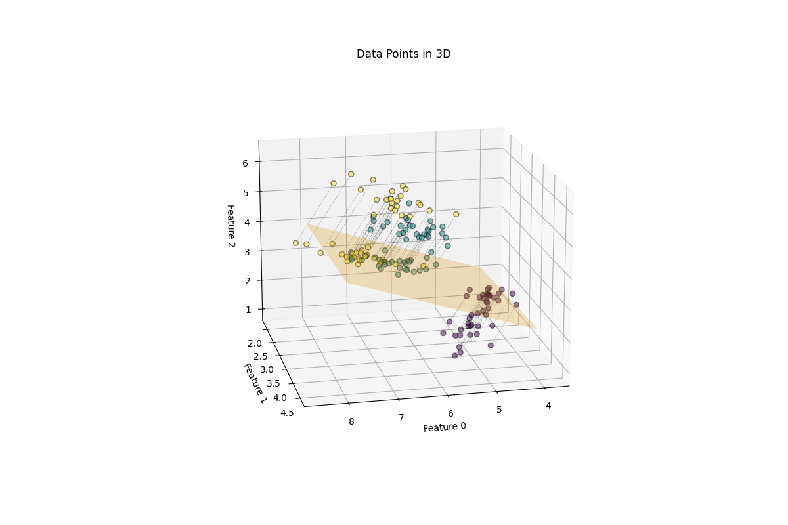
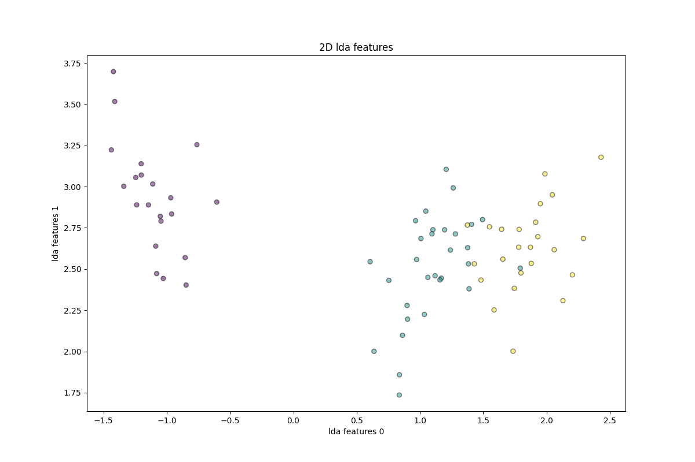

# Machine Learning Algorithms Implemented with NumPy

This repository contains simple implementations of classic machine learning algorithms using only **NumPy**. It is designed as a learning resource to help understand the core mechanics of these algorithms. The implementations are evaluated using k-fold cross-validation and compared with their counterparts in **scikit-learn** on well-known datasets such as the **Iris** and **Diabetes** datasets.

Although the performance doesn't always surpass scikit-learn's highly optimized versions, these implementations provide a clear and concise view of how these algorithms work under the hood.

## Implemented Algorithms
- **Linear Regression**
- **Logistic Regression**
- **Linear Discriminant Analysis (LDA)**
- **Random Forest**

## Quick Start Guide

### Prerequisites
- **Operating System**: Ubuntu
- **Conda**: Anaconda or Miniconda installed on system

### Setup Instructions
1. **Clone the repository**
    ```bash
    git clone https://github.com/Calvin9c/ML-with-NumPy.git && cd ML-with-NumPy
    ```
2. **Create a Conda environment and install dependencies**
    ```bash
    conda create -n <ENV_NAME> python=3.10 -y
    conda activate <ENV_NAME>
    pip install -r requirements.txt
    ```
3. **Run the evaluation script**
    ```bash
    % test linear regression
    python -m tests.test_linear_regression

    % test logistic regression
    python -m tests.test_logistic_regression

    % test LDA
    python -m tests.test_linear_discriminate_analysis 

    % test random forest
    python -m tests.test_random_forest
    ```

## Model Performance Comparison

In this repository, we evaluate our implementations alongside scikit-learn's implementations using the `Diabetes` dataset for regression tasks and the `Iris` dataset for classification tasks. For regression, we use mean_squared_error from scikit-learn as the evaluation metric, and for classification, we use accuracy_score.

For more details on the evaluation process and how to use our implementation, please refer to the files in the `tests` folder.

 - **Linear Regression**
    | Fold | Our(Grad. Descent) | Our(Normal Eq.) | Sklearn(Normal Eq.) |
    |:---:|:---:|:---:|:---:|
    | 1 | 3157.92 | 3180.16 | 3180.16 |
    | 2 | 3420.24 | 2957.99 | 2957.99 |
    | 3 | 3718.69 | 3018.85 | 3018.85 |
    | 4 | 3387.73 | 2745.43 | 2745.43 |

 - **Logistic Regression**
    | Fold | Our | Sklearn |
    |:---:|:---:|:---:|
    | 1 | 0.9211 | 0.9737 |
    | 2 | 0.9737 | 0.8947 |
    | 3 | 1.0000 | 1.0000 |
    | 4 | 0.9459 | 0.9459 |

 - **Linear Discriminate Analysis(LDA)**

   <p align="center">
   
   
   </p>

    | Fold | Our(Nearest Mean) | Our(kNN) | Sklearn(kNN) |
    |:---:|:---:|:---:|:---:|
    | 1 | 0.9737 | 0.9737 | 0.9737 |
    | 2 | 0.9474 | 0.9474 | 0.9474 |
    | 3 | 1.0000 | 1.0000 | 1.0000 |
    | 4 | 0.9730 | 0.9459 | 0.9459 |

 - **Random Forest**
    | Fold | Our | Sklearn |
    |:---:|:---:|:---:|
    | 1 | 0.9737 | 0.9737 |
    | 2 | 0.8947 | 0.9211 |
    | 3 | 0.9730 | 1.0000 |
    | 4 | 0.9459 | 0.9459 |

## Attribution
If you use this project in your work, please provide proper attribution by linking back to this repository.